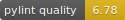

teahaz.py
=========

## My ad-hoc checklist/API documentation
Note: All endpoint URLs should be used in the form: `http(s)://<server_url>/<endpoint>`

- [x] Datatypes
    * [x] Channel:
        + channel_name: `str`
        + channelID: `str`,
        + public: `bool`
        + permissions: `dict`, items:
            - r: `bool`
            - w: `bool`
            - x: `bool`

    * [x] User:
        + userID: `str`
        + username: `str`
        + color: `dict`, items:
            - r: `int`
            - g: `int`
            - b: `int`

    * [x] Message:
        + messageID: `str`
        + channelID: `str`
        + userID: `str`
        + keyID: `str`
        + send_time: `float`
        + type: `str`
        + data: `Union[str, bytes]`

- [x] Chatroom: `/chatroom/`
    * [x] get: Unknown
    * [x] post:
        + username: `str`
        + password: `str`
        + chatroom_name: `str`
        + -> Create chatroom
    * note: this endpoint does **not** require `chatroom_id`

- [x] Login: `/login/<chatroom_id>`
    * [x] get: 
        + userID: `str`
        + -> Check if logged in:
            - `200`: logged in
            - `401`: not logged in
    * [x] post:
        + userID: `str`
        + password: `str`
        + -> Return chatroom data
            - chatroomID: `str`
            - userID: `str`
            - channels: `list[Channel]`

    * note: `userID` to become `username` in the near future.

- [x] Users: `/users/<chatroom_id>`
    * [x] get:
        + userID: `str`
        + -> Return all users in a chatroom: `list[User]`
    * [x] post: None

- [x] Channels: `/channels/<chatroom_id>`
    * [x] get:
        + userID: `str`
        + -> Return all channels a user has read-access to: `list[Channel]`
    * [x] post:
        + userID: `str`
        + channel_name: `str`
        + -> Create a chatroom

- [x] Messages: `/messages/<chatroom_id>`
    * [x] get:
        + userID: `str`
        + count: `Optional[int] <= 100`
        + time: (epoch) `Optional[float]`
        + get-method: one of `["since", "count"]`
        + channelID: `Optional[str]`
        + -> Get list of messages: `list[Message]`
    * [x] post
        + userID: `str`
        + channelID: `str`
        + replyID: `str`
        + data: `str`
        + -> Send a message
    * note: `channelID` can filter messages by channel
